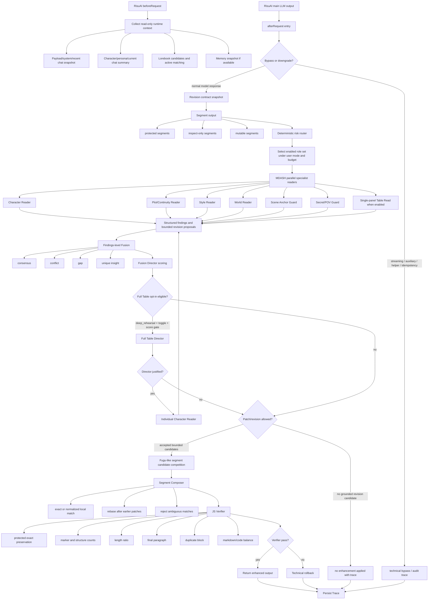

# 2.5 MDASH / Fusion / Fugu Full Flow

Date: 2026-07-01

Status: active sequence map after the first verified `fusion_enhance` trace

## Purpose

This document fixes the full operating order for the 2.5 standalone RisuAI
output quality layer.

The plugin is not a suggestion-only reviewer and not a generic whole-output
rewriter. The target system is:

```text
RisuAI main LLM output
-> protected segmentation
-> specialist MDASH readers
-> Fusion consensus/conflict scoring
-> bounded Fugu-like revision competition on risky segments
-> segment composer
-> JS verifier
-> enhanced output; technical rollback only on structural failure
```

The goal is a better final RP output while preserving images, status blocks,
RisuAI markers, code, JSON-like structures, user agency, secret boundaries,
POV, final paragraph, and scene continuity.

## Current Completion Snapshot

Approximate current state after the 0.1.28 P4 implementation:

| Area | Current state | Completion |
| --- | --- | --- |
| Standalone single JS runtime | Works | High |
| Role profile UI | Works, still rough | Medium |
| Runtime context collector | Works read-only | Medium-high |
| Parallel role calls | Works | Medium-high |
| MDASH role separation | Works for core readers/guards | Medium |
| Fusion findings merge | Works | Medium-high |
| Fusion Director scoring | Works | Medium |
| Verified enhanced output return | Works in trace | Medium |
| Patch apply stability | Normalized/evidence-anchor matching added | Medium |
| Reasoning-only response control | Retry downgrade and Trace stats added | Medium |
| Segment-level Fusion Composer | Segment candidates and overlap checks added | Medium |
| Router and cost profiles | Four routing profiles and cost trace added | Medium |
| Fugu-like candidate competition | Partial | Low-medium |
| Full Table Read | Conditional opt-in execution added | Medium-low |
| Long-run reliability | Needs more tests | Medium-low |

Overall practical maturity: alpha, about 63-67%.

## Concept Mapping

### MDASH

MDASH means role-separated specialist review.

It answers:

- Which AI role should inspect which risk?
- Which role owns character voice, continuity, style, POV, world, scene anchor,
  or Table Read signals?
- How do we keep small/cheap models useful by making each one focus on one
  narrow job?

Active MDASH roles:

- `character_reader`: character voice, knowledge boundary, agency.
- `plot_continuity_reader`: causality, scene flow, POV transition, continuity.
- `style_reader`: rhythm, repetition, awkward phrasing, tone.
- `world_reader`: visible lore and world-rule consistency.
- `scene_anchor_guard`: location, object position, action order, body anchor.
- `secret_pov_guard`: private knowledge, secret identity, narrator scope, POV.
- `single_panel_table_read`: compact panel review when enabled.

### Fusion

Fusion means structured synthesis of those role outputs.

It answers:

- Which findings agree?
- Which findings conflict?
- Which role found a unique issue?
- Which expected lane was silent?
- Which patch should survive when two roles propose different fixes?

Fusion outputs:

- accepted findings
- rejected findings
- consensus signals
- conflict signals
- gap signals
- unique insight signals
- Director score
- accepted patches
- rejected patches with reason

### Fugu

Fugu is used only as a bounded inspiration for adaptive segment improvement.

It does not mean:

- AI-controlled recursive agent calls
- hidden provider/model expansion
- unbounded multi-step planning
- whole-output rewrite
- silent cost escalation

Allowed Fugu-like behavior:

- deterministic JS selects risky segments
- fixed enabled roles produce local revision candidates
- candidates compete inside a hard cap
- Fusion Director selects or rejects candidates
- Segment Composer applies only bounded operations
- JS Verifier must pass before returning enhanced output

### Table Read

Table Read is a higher-cost review source, not the main writer.

Single-panel Table Read:

- may run as a compact simulated panel
- emits notes and recommended findings
- confidence is discounted
- Fusion Director decides whether it matters

Full Table Read:

- explicit opt-in only through `deep_rehearsal` mode plus the full-table toggle
- recommended by escalation signals
- executes only when the important-scene score, risk score, non-streaming gate,
  and runnable role profiles all pass
- P3 execution uses `full_table_read_director` followed by
  `individual_character_reader`
- findings feed back into Fusion; they never directly rewrite final prose
- Trace must show cost/call budget, blockers, executed roles, and added findings

## Full Flow Diagram



## Operational Order

### 1. Input and context phase

1. Collect request payload context as trace-only material.
2. Collect RisuAI character/persona/current chat through guarded API wrappers.
3. Collect lorebook candidates.
4. Match active lorebook entries only as best-effort inspect-only context.
5. Collect Supa/Hypa/current-chat memory fields if available.
6. Never write RisuAI state.

Output:

- `runtime_context`
- source availability trace
- bounded inspect-only context block

### 2. Safety and segmentation phase

1. Record revision contract.
2. Detect streaming, auxiliary/helper/submodel, LUA-like bypass, and idempotency.
3. Split output into:
   - protected
   - inspect-only
   - mutable
4. If there are no mutable segments, keep original.

Output:

- segment map
- marker catalog
- protected counts
- mutable surface stats

### 3. Router phase

1. Use deterministic JS risk signals.
2. Select roles only from enabled profiles.
3. Apply the selected routing profile: `cost_save`, `balanced`, `quality`, or
   `debug_all`.
4. Respect user mode, hard gates, call caps, and parallel caps.
5. Keep Full Table Read behind the P3 `deep_rehearsal` opt-in and score gate.
6. Record why each role ran or skipped.

Base `fusion_enhance` roles:

- `character_reader`
- `plot_continuity_reader`
- `style_reader`
- `secret_pov_guard`

Conditional roles:

- `scene_anchor_guard`
- `world_reader`
- `single_panel_table_read`
- future artifact/mechanical guard

### 4. MDASH reader phase

Each role receives:

- visible draft
- protected/mutable segment map
- read-only runtime context block
- role-specific prompt
- strict JSON schema

Each role returns:

- findings
- evidence quote
- segment id
- severity
- confidence
- bounded patch or revision proposal when allowed

Roles must not:

- rewrite the full output
- modify protected spans
- invent new RisuAI state
- call other roles

### 5. Fusion findings phase

Normalize all role outputs into a shared findings schema.

Compute:

- same-issue consensus
- same-domain consensus
- conflicting replacements
- expected-lane gaps
- unique insights

This phase decides which findings matter, not yet how to apply them.

### 6. Fusion Director phase

The Director scores findings and patches using:

- role priority
- lane priority
- severity
- confidence
- consensus bonus
- unique insight bonus
- conflict penalty
- patch locality
- protected risk

Director output:

- accepted patches
- rejected patches
- conflict winners
- reject reasons
- score trace

### 7. Full Table Read opt-in phase

Full Table Read is an escalation source that can add deeper findings before
final composition.

It may execute only when all gates pass:

1. The active mode is `deep_rehearsal`.
2. The user enabled the full-table opt-in toggle.
3. The turn is not streaming or auxiliary.
4. The escalation score reaches `recommend`.
5. `full_table_read_director` and `individual_character_reader` are enabled
   and runnable.

Execution order:

1. Core MDASH readers run first as a precheck.
2. JS computes important-scene and risk scores.
3. `full_table_read_director` decides whether the already-gated extra pass is
   still justified.
4. If justified, `individual_character_reader` performs a deeper character
   pass.
5. Added findings re-enter findings-level Fusion and the JS Director decision
   is recomputed.

Full Table Read must not:

- directly rewrite final prose
- run silently in normal `fusion_enhance`
- bypass protected segment rules
- exceed the visible opt-in call budget

### 8. Fugu-like segment candidate phase

This is the bounded adaptive improvement layer.

For each risky mutable segment:

1. Gather accepted patches for that segment.
2. Group overlapping patches.
3. Compare candidate replacements.
4. Prefer semantic/continuity/POV fixes over style-only changes.
5. Keep only a small number of candidates.
6. Never generate a whole-output rewrite.

This is the correct place to expand toward Fugu. The system should become
better at choosing among local candidates, not more autonomous about calling
unbounded agents.

### 9. Segment Composer phase

Apply accepted changes only when the target is unambiguous.

Current limitation:

- exact match can fail after earlier patches or minor text drift.

Required next behavior:

- exact match first
- normalized whitespace/punctuation match
- segment-local search
- evidence-quote backup anchor
- rebase after earlier applied patches
- reject if zero or multiple credible matches

Composer must record:

- applied
- rejected
- ambiguous find
- rebase result
- reason category
- reason detail

### 10. JS Verifier phase

The JS verifier has final veto authority.

Required gates:

- protected span preservation
- marker count preservation
- structure count preservation
- length ratio
- final paragraph preservation
- duplicate block detection
- markdown/code fence balance

If verifier finds structural damage, perform technical rollback and record why.

### 11. Return and Trace phase

Return modes:

- `enhanced`: verifier passed and output was strengthened.
- `original`: technical rollback, explicit audit-only mode, or no grounded candidate.
- `audit_only`: role findings recorded but output unchanged.
- `off`: bypass, downgrade, or technical rollback.

Trace must show:

- executed roles
- skipped roles and reason
- provider/model/reasoning settings
- raw preview for failures
- findings
- consensus/conflict/gap/unique insight
- accepted/rejected patches
- verifier gates
- final output state

## Implementation Roadmap From Current State

### P0: Patch Apply Stability

Goal:

- Increase the percentage of good accepted patches that actually apply.

Tasks:

1. Add normalized segment-local matching.
2. Add evidence-quote backup-anchor matching.
3. Add rebase after earlier patch application.
4. Add better Trace detail for match failure.
5. Keep ambiguity fail-closed.

Why first:

- The 0.1.23 trace already showed accepted patches can fail with
  `find text matched 0 times`.

Implemented in 0.1.24:

- Exact match still runs first.
- If exact match fails, the patch applier tries whitespace/quote-normalized
  segment-local matching.
- If that still fails, it tries compact normalized matching for spacing drift.
- If the find text is ambiguous or missing but a unique evidence quote is
  available, the applier may use that quote as a local anchor and then resolve
  the find text inside that anchor.
- Earlier applied patches rebase naturally because each later patch resolves
  against the current segment text.
- Ambiguous or missing matches remain fail-closed.
- Trace now records match strategy, exact count, normalized count, matched
  length, evidence anchor strategy, and match detail for each patch.

### P1: Reasoning-only Response Control

Goal:

- Reduce retry dependence for GLM/DeepSeek/KiMi-like providers.

Tasks:

1. Track role/model/provider reasoning-only rates.
2. Add per-role automatic retry profile downgrade.
3. Recommend effort changes in Trace.
4. Prefer JSON-only short retry prompts for problem models.
5. Keep provider/model-specific reasoning adapters current.

Implemented in 0.1.25:

- Role/model/provider stats now include reasoning-only rate, invalid-JSON rate,
  retry downgrade count, and recommendation text.
- `provider_reasoning_without_content`, invalid JSON, and empty-findings retry
  paths now use a reasoning-controlled retry profile.
- Retry profile lowers/disables reasoning where possible, forces JSON response
  format, lowers temperature, and increases max output tokens.
- GLM 5.2 retry downgrades to `reasoning_effort: none` with `think:false`.
- DeepSeek retry supports the explicit `deepseek` preset and downgrades to
  `disable` for JSON repair paths.
- Kimi/K2/Moonshot-like models are detected as reasoning-risk models for compact
  JSON-only retry prompts.
- Trace now records retry reasoning mode, retry adjustment, reasoning
  recommendation, and a `reasoning_control.v1` summary.

Needs live model testing:

- Confirm each provider accepts the downgraded request fields as expected.
- Confirm GLM/DeepSeek/Kimi retries put JSON in final/content rather than hidden
  reasoning.

### P2: Segment-level Fusion Composer

Goal:

- Move from independent patch application to segment-level candidate selection.

Tasks:

1. Group patches by segment.
2. Detect overlaps before applying.
3. Build one candidate segment revision when multiple compatible patches exist.
4. Score candidate segment revisions.
5. Run JS verifier on the whole candidate output.

Implemented in 0.1.26:

- `composeFusionSegmentsPartial` now uses a real segment-level composer instead
  of simple sequential patch application.
- Patches are grouped by mutable segment before composition.
- Each patch is resolved against the original segment text, then overlapping
  patch spans compete by Director score, lane priority, confidence, and Fusion
  signal tags.
- Compatible non-overlapping patches in the same segment are merged into one
  candidate segment revision.
- A candidate segment revision is applied as a unit, then checked through the JS
  verifier against the whole output.
- Patch count and changed-character budgets are enforced at the candidate level.
- Trace now records composer strategy, candidate count, candidate scores,
  applied/rejected candidate counts, patch candidate status, match span, and
  overlap winner.

Needs live model testing:

- Confirm real GLM/DeepSeek/Kimi patch candidates often become compatible
  segment candidates instead of being rejected as overlaps.
- Confirm the composer improves multi-patch scenes without causing verifier
  fallback spikes.

### P3: Full Table Read Opt-in Execution

Goal:

- Convert current escalation recommendation into real optional execution.

Tasks:

1. Add explicit user opt-in gate.
2. Display call budget estimate before execution.
3. Run only when escalation score is high enough.
4. Feed panel findings into Fusion, not direct prose.
5. Keep single-panel as the normal compact path.

Implemented in 0.1.27:

- `deep_rehearsal` can now remain active when the full-table opt-in toggle is
  enabled. If the toggle is off, it downgrades to `standard_check`.
- Full Table Read execution is gated by mode, toggle, non-streaming state,
  escalation score, and runnable role profiles.
- The execution path runs `full_table_read_director` first, then
  `individual_character_reader` only when the director keeps the pass justified.
- Full Table Read findings are normalized as `full_table_read_opt_in` and fed
  back into findings-level Fusion before the JS Director decision is finalized.
- `deep_rehearsal` uses the same bounded Segment Composer and JS verifier return
  path as `fusion_enhance`; verified enhanced output may be returned.
- Trace now records `full_table_read` execution state, planned/executed/skipped
  roles, blockers, budget estimate, director decision, and added finding count.

Needs live model testing:

- Confirm the director does not over-approve ordinary scenes.
- Confirm the individual character reader returns exact evidence and bounded
  patches rather than broad critique.
- Confirm the extra calls improve important scenes enough to justify cost.

### P4: Router and Cost Profiles

Goal:

- Avoid calling every role on simple turns while still escalating important
  scenes.

Tasks:

1. Add routing profiles: cost-save, balanced, quality, debug-all.
2. Make full test mode call all enabled roles.
3. Make normal use mode risk-based.
4. Record role reason in Trace.
5. Use model failure stats for recommendations.

Implemented in 0.1.28:

- Added `routing_profile` with four profiles:
  - `cost_save`: smallest useful reader set; optional roles wait for strong
    risk signals.
  - `balanced`: default MDASH behavior; core readers plus secret/POV guard,
    risk-based scene anchor, and user-enabled single-panel.
  - `quality`: adds enabled world and scene-anchor readers earlier for dense or
    important scenes.
  - `debug_all`: explicit test profile that calls all enabled review roles,
    including single-panel if that role is enabled. Full Table Read still uses
    the P3 `deep_rehearsal` opt-in and score gate.
- The deterministic router now records:
  - selected/skipped role reason
  - routing profile
  - provider/model/tier metadata
  - estimated cost weight
  - conditional gated calls such as Full Table Read
- Trace now shows routing profile and cost summary in the Role Router panel.
- Model failure statistics now feed router recommendations, so unstable models
  can be noticed before raising the profile from balanced to quality/debug-all.

Needs live model testing:

- Confirm `cost_save` does not miss too many important secret/POV issues.
- Confirm `balanced` remains the practical default for normal RP turns.
- Confirm `quality` gives better findings often enough to justify the extra
  calls.
- Confirm `debug_all` is useful for development traces without being used as a
  normal play setting.

### P5: UI and Release Hardening

Goal:

- Make the plugin configurable by a normal user.

Tasks:

1. Clean Korean labels and corrupted text.
2. Add provider/model diagnostics.
3. Add preset import/export.
4. Add trace filters and compact summaries.
5. Add regression samples.
6. Package release zip.
7. Add live QA samples for repeated phrasing / repeated beats that are not large
   duplicate blocks, then decide whether this belongs in style prompts,
   deterministic risk routing, or verifier warnings.

## Near-term Work Order

The next concrete implementation order should be:

1. Patch Apply Stability. Done in 0.1.24.
2. Reasoning-only Response Control. Done in 0.1.25; live provider testing still
   required.
3. Segment-level Fusion Composer. Done in 0.1.26; live multi-turn testing still
   required.
4. Full Table Read Opt-in Execution. Done in 0.1.27; live important-scene
   testing still required.
5. Router and Cost Profiles. Done in 0.1.28; live profile comparison testing
   still required.
6. UI and Release Hardening.

This order matters. Full Table Read and dynamic Fugu-like expansion should not
come before patch application and verifier behavior are reliable.

## 2026-07-03 Standalone Priority Update

Current implementation focus:

1. Strengthen standalone Fusion quality before any Archive Center integration.
2. Strengthen deterministic Fugu-like role routing and candidate competition
   without hidden recursive calls or hidden model expansion.
3. Keep MDASH role separation as the fixed specialist foundation.
4. Defer Table Read expansion until Archive Center connected memory can supply
   per-character subjective memory, lorebook, persona, and scene context.
5. Defer MariaDB/ChromaDB Archive Center integration until the standalone
   output-quality layer visibly improves final output on its own.

Build `0.1.60` locks this direction more explicitly: the product goal is
aggressive grounded improvement, not advice-only review. Verification remains a
final QA gate, while MDASH specialists, Fusion scoring, and Fugu-like routing
must push toward stronger returned prose.

## Acceptance Criteria For 75 Percent Maturity

The plugin can be considered roughly 75% complete when:

- `fusion_enhance` reliably returns enhanced output on suitable turns.
- Good accepted patches rarely fail due to exact-match drift.
- GLM/DeepSeek reasoning-only failures are automatically mitigated.
- Segment-level composition handles overlapping patches through deterministic gates.
- Table Read can run as explicit important-scene opt-in.
- Trace explains every role, patch, rejection, technical rollback, and verifier gate.
- New users can configure provider/model/reasoning profiles without reading
  source code.

## Non-negotiable Authority Order

The system must always follow this authority order:

```text
protected contract
> user mode and toggles
> deterministic JS router
> specialist reader findings
> Fusion Director
> bounded Fugu-like segment candidate selection
> Segment Composer
> JS Verifier
> stronger enhanced output; technical rollback only on structural failure
```

No AI role may bypass this chain.
